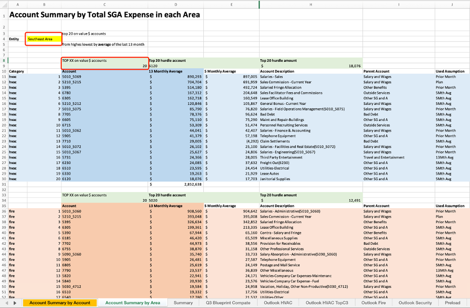

# BSNA-SGA Expense Projection Analysis Methodology
---
## Johnson Controls - Summer 2022
### Finance and Accounting Intern: Xiaozhe Zhang
### Managers: Patrick Levenhagen, Pablo Zorrilla
---
### Purpose of the Analysis Methodology
This SGA team in Business Solution North America (BSNA) is utilizing the best effort and resources to forecast the future SGA expense in BSNA by different analysis tools and projection methods. The team would like to continuously develop a comprehensive and inclusive approach to bring the projection closer to the actual number, so that other departments and upper management would have a clear and broad picture to plan future strategies and decisions. Therefore, this SGA Expense Projection Analysis Methodology is aimed to identify different major components in those SGA expense accounts and verify the applicability and accuracy of the current projection methods for those accounts.

### Materials for Analysis
#### SGA Outlook for each month
This document includes the detailed projected numbers based on three projection methods for different accounts, composing SGA expense the BSNA, on the Area level (ex. Northeast, Mid-Atlantic, etc.)
- Example Excel File: “SGA Outlook template – Jun FY22”

#### Actual SGA expense for each month
This document includes the actual historical numbers for different accounts, composing SGA expense the BSNA, on the Area level (ex. Northeast, Mid-Atlantic, etc.)
- Example Excel File: “SGA Full Worksheet - 6 - 16 - 22”

#### Monthly Bad Debt Projection Analysis
This document includes the bad debt accounts based on the actual monthly conditions. The file would be helpful for the SGA team to study when doing the bad debt for SGA expense projection. 
- Example Excel File: “HVAC TWC Draft.xlsb”

### Working Method
1. Identifying the Top 20 SGA expense accounts for different fields, including HVAC, Fire, and Security.
2. Pressure testing the projection method for those top accounts in different fields, including HVAC, Fire, and Security.
3. Optimizing and modifying the projection methods for those top accounts in different fields, including HVAC, Fire, and Security.

### Dynamic Top 20 SGA Expense Accounts Identification
The following description is composed of two sections: 
1. Account Summary by Account (Figure 1) describes the Top 20 accounts by **projection** only by HVAC, Fire, and Security field without any reference to the Area level. “Account Summary by Account” sheet is connected to the “Outlook HVAC,” “Outlook Fire,” and “Outlook Security.” Therefore, it is a dynamic file that would adapt automatically to any modifications from later files. People could also edit the “TOP XX on values $ accounts” section. More specifically, people can type in “10” to find the Top 10 accounts by **projection**.
 
 
(Figure 1 Account Summary by Account)

2. Account Summary by Area (Figure 2) adapts the same logic to find the Top 20 accounts projection and can also be modified to a different number. What is different is that this model allows people to change the Entity by Area. Figure 2 shows the Top 20 accounts from HVAC, Fire, and Security in the Southeast Area, so the Top 20 accounts’ details would be different if they were in Texas.

(Figure 2 Account Summary by Area)
 
### SGA Projection Method Optimization
The Top 20 accounts from different fields (20*3 = 60 in total), regardless of Areas (Figure 1 Account Summary by Account), are employed in the optimization analysis. They can provide a comprehensive overview of the projection method optimization. Figure 3 illustrates the actual expense from the historical record and projected for each top account in HVAC. Something needs to be aware that there are 4 currently used projection methods – 13M Avg, 5M Avg, Workplan, and Prior Month. The following equation is employed to find the projected expense’s percentage of change from the actual: 

$$
\frac{|\text{Projected Expense} - \text{Actual Expense}|}{\text{Actual Expense}} \times 100\%
$$
(The absolute value of the difference between projected and actual expense is divided by the actual expense and times 100%)

Since there are many months for each account, there are different percentages of change for each account and each time. The individual projected expense’s percentage of change from the actual for each account is the average number of the overall months in the same account. However, since the individual account is over a long span, there are some significant deviations from the percentage of change. It is necessary to remove its outliers to make the average number more reliable. Here, IQR (Interquartile Range) Method is adapted to remove outliers. Outliers are individual values that fall outside of the overall pattern of a dataset, and the IQR rule is a common and helpful way to detect the presence of outliers.

$$
\text{IQR} = Q_3 - Q_1
$$

where:

- $Q_1$ is the value that is at the first quartile, or a quarter of the way through the sorted list of all data.
- $Q_3$ is the value that is at the third quartile, or three-quarters of the way through the sorted list of all data.

From the Penn State University, Eberly College of Science, “We can use the **IQR method* of identifying outliers to set up a “fence” outside of Q1 and Q3. Any values that fall outside of this fence are considered outliers. To build this fence we take 1.5 times the IQR and then subtract this value from Q1 and add this value to Q3. This gives us the minimum and maximum fence posts that we compare each observation to. Any observations that are more than 1.5 IQR below Q1 or more than 1.5 IQR above Q3 are considered outliers.”
Before removing outliers in the dataset for each account, the overall average and standard deviation are polarized into extremely high and low values. After removing outliers in the dataset for each account, the overall average and standard deviation are adjusted to more applicable values and become more reliable to utilize.

 
(Figure 3 Actual expense for each account vs Projected expense by different projection methods for each account)

Figure 4 assembles each of the Top 20 accounts for each HVAC, Fire, and Security field. Even though this figure shows many numbers, people need to focus on “Average” under “Adjusted for Possible Outliers” section. This part of the data demonstrates the average projected percentage of change from the actual SGA expense under 4 different currently used projection methods (13Mth Avg, 5Mth Avg, Workplan, and Prior Month) after removing the outliers. Then, for each account, the projection method holding the least absolute average percentage value would theoretically be the best projection method for the corresponding account. By comparing the best projection method with the currently used projection method, people will identify if the current projection method is not very fit into the historical performance of the company’s SGA expense and make some adjustments for better projection in upcoming months.

(Figure 4 Adjusted Projection Method for each account based on Average percentage of change)

### Method Constraints and Remaining Questions
- One of the most considerable constraints in the optimization method is that the analysis is based on the company's historical performance, and the best project method is derived from past numbers. Then, the projection method is adapted to predict the future SGA expense for the company, which makes the projection tricky. There is no denying that many SGA expense accounts have a trend since most cost structures are relatively fixed and very predictable (ex. Salaries, Lease Office Building, Vacation, Holiday, Other Non-Productive, etc.) However, many accounts have different dynamic factors and structures that project not very applicable (ex. Sale Commission, Bad Debt, General Bonus, Provision for Receivables, etc.)
- In addition, the SGA team employees are professionals in predicting the expense. They understand the profound logic and current market trend, which would impact how to project the expense. Therefore, the optimized projection methods may be solely a reference for SGA professionals. 
- Suppose SGA professionals identify some projection method after reviewing the optimization and decide to change the projection method. In that case, they need time to testify whether the adjusted projected way is more accurate than before. Thus, switching to the best projection method would take significant time.
- As mentioned before, the BSNA Bad Debt team has developed the Monthly Bad Debt Projection Analysis document, and it could be a breakthrough to project the bad debt according to a detailed study rather than a simple average number for the past few months. 
