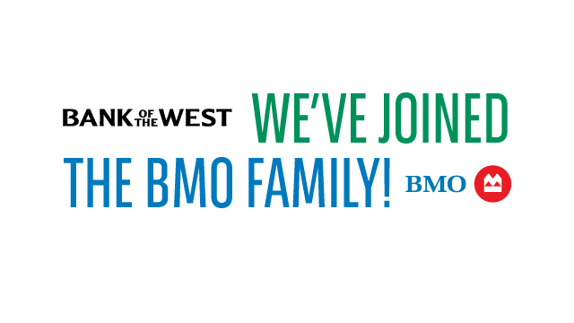

## About Me

I am a master's student in Mathematical Finance at Boston University, bringing a solid foundation in science and finance to my studies. I graduated from Lehigh University in 2023 with a dual major in Finance and Business Information Systems. I have demonstrated a strong aptitude for programming, statistics, and data analysis and have explored various applications of these skills in finance. In particular, I am deeply interested in algorithmic trading, quantitative finance, AI, and Machine learning.

**| Extroverted Quant | Embracing Bold Thinking & Big Dreams | Passion, Mission, Commitment |**

---

## Skills

**Programming**: R Python, R, SQL, Java, C++, Pandas, NumPy, Polars, Scikit-learn, SciPy, TensorFlow, pypfopt

**Methods**: Econometrics, OLS, Time Series, Bayesian, Factor Modeling, NLP, Machine Learning

---

## Internship

<!-- You can link to other websites, PDFs in this repo, and other pages in this repo -->

_**[Investment Model Consolidation via Hierarchical Clustering](Investment_Model_Consolidation/clustering.md)**_

---

_**[Johnson Controls Internship Project SGA Account Optimization Analysis](/JCI/JCIinternship.md)**_

---

## Project

<!-- You can link to other websites, PDFs in this repo, and other pages in this repo -->

_**[Sentiment Analysis on FY2022 10-K Reports from S&P 500 Companies: NLP Practice](NLP_report/report.md)**_

---

_**[Analyzing Bank of the West Lending Practices](https://github.com/LeDataSciFi/FinTech-Capstone-2023/?tab=readme-ov-file#executive-summary)**_

In 2023, following its acquisition of Bank of the West (BOW), Bank of Montreal (BMO) aimed to ensure equitable lending practices. The study assessed BOW's lending behaviors by analyzing 2021 loan-level data from the Home Mortgage Disclosure Act (HMDA) and Census tract demographics for Arizona and California. Findings showed that BOW had fewer applications in high Black and Hispanic areas but lower denial rates than similar banks. In contrast, high Asian areas saw more applications but higher denial rates. The analysis provides insights for BMO Harris to serve underserved communities better.

---

_**[Johnson Controls Internship Project SGA Account Optimization Analysis](/JCI/JCIinternship.md)**_

---

## Career Objectives

- Quant Research/Analyst/Trading
- Portfolio Analyst/Asset Management
- Quant Risk/Credit Risk

---

## Hobbies and Interests

- Gym
- Edm Music
- Light Designing and DJing
- Science Fiction: *Dune, Foundation and Empire, 3 Body Problem,  Legend of the Galactic Heroes*
