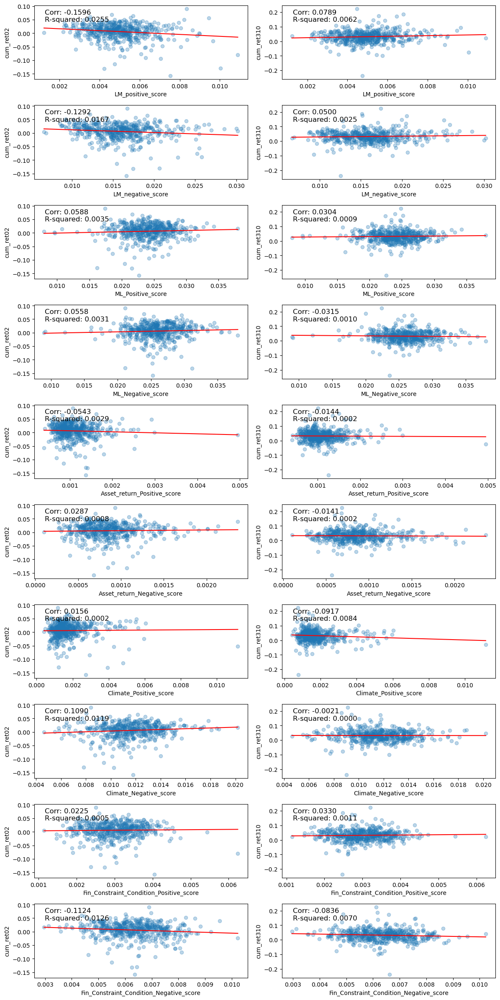

# Sentiment Analysis on FY2022 10-K Reports from S&P 500 Companies

## Summary

This study presents a sentiment analysis of the fiscal year 2022 (FY2022) 10-K reports of S&P 500 companies. This research aims to evaluate whether certain words used in the 10-K report have a positive or negative tone and whether these sentiment variables are associated with the cumulative returns of two different periods since the 10-K filing date release. Specifically, I examine whether positive or negative sentiment in a 10-K is associated with better/worse stock returns. To achieve this objective, I obtained the 10-K reports of S&P 500 companies from the Securities and Exchange Commission (SEC) website and extracted the filings made in FY2022. I then merged the S&P 500 companies' list dataset with the daily returns dataset of each company to calculate the cumulative returns after the filing dates. I employed various word lists, such as the Loughran-McDonald Master Dictionary w/ Sentiment Word Lists (LM), Machine Learning word list (ML), Asset Return, Climate, and Financial Constraints Conditions, to evaluate the sentiment of the 10-K reports and compared the cumulative returns for correlation analysis.

The findings suggest that all sentiment variables have a certain level of either positive or negative correlations; however, these correlations are not statistically significant. Nonetheless, the results provide a valuable reference for understanding the relationship between the content in 10-K reports and the corresponding cumulative return of the firm. Furthermore, this study highlights the potential for continued modification and adaptation of new technologies or instruments to enhance the model's performance.

## Data Description

### Data Sources and Samples

Samples in this sentiment analysis come from multiple sources, including a [list of current S&P 500 companies](https://en.wikipedia.org/wiki/List_of_S%26P_500_companies) by March 24, 2022, from Wikipedia, 10-K reports from [SEC EDGAR | Company Filings](https://www.sec.gov/edgar/searchedgar/companysearch) , and relevant supporting datasets provided by Professor Donald Bowen's [repo for 2023 FIN377 class at Lehigh University](https://github.com/LeDataSciFi/data). To be more specific, inside Professor Bowen's repo, the overall unfiltered companies' daily returns of 2022 are found in [crsp_2022_only.zip](https://github.com/LeDataSciFi/data/tree/main/Stock%20Returns%20(CRSP)), and [2021 accounting data (2021_ccm_cleaned.dta)]() from the repo.

### Stock Return Preparation and Cleaning

The sentiment analysis aims to understand the cumulative stock return of S&P500 companies over two time periods, including from the release date (t) of the 10-K filing to 2 business days after the release (t+2) and from the 3 business days after the release (t+3) to 10 business days after the release (t+10).
Therefore, this procedure aims to obtain the cumulative stock return of all S&P 500 companies over two periods: t to t+2 (cum_ret02) and t+3 to t+10 (cum_ret310). Before getting a dataframe with each row containing the company information and the cumulative return, some merging practices on the provided datasets are necessary.

To extract the filing dates for the S&P 500 companies, we need to parse the filing dates from SEC EDGAR html. 
The html has the following structure:  ```https://www.sec.gov/Archives/edgar/data/{cik}/{accession_number}-index.html```.
After successfully parsing the filing dates and corresponding company information into a dataframe called ```filing_datedf```, we need to merge filing_datedf to the Stock returns for 2022 (crsp_2022_only dataframe, extracted from crsp_2022_only.zip).
 
An inner merge would be appropriated to merge these two dataframes, because we will only analyze companies that have stock returns, and the inner join returns only the rows that have matching values in both the left (crsp_2022_only) and right (filing_datedf) data frames based on the common column.

The merged df (merged_filingdfv1) has the following heading:


| Symbol | date_x | ret | Security | CIK | Accession_Num | date_y
|----------|----------|----------|----------|----------|----------|----------


date_x: is the date variable from the 2022 stock return 
date_y: is the exact filing date for S&P 500 companies

Next, cleaning and filtering out unnecessary rows in the merged df (merged_filingdfv1) helps prepare the calculation for the cumulative return over two time periods. 
1. For each company, filter out rows that are before the filing date (date_y) in their date_x variable.
2. Filter out rows for each company from the filing date (t) to 2 business days after filing date (t+2) and save them as a new dataframe (merged_filing02df)
    ```python
    merged_filing02df= merged_filingdfv1.groupby('Symbol').head(3)
    
    ```

3. Filter out rows for each company 3 business days (t+3) to 10 business days after the filing date (t+10) and save them as a new dataframe (merged_filing310df)
    ```python
    merged_filing310df= merged_filingdfv1.groupby("Symbol").apply(lambda x: x.iloc[3:11]).reset_index(drop=True)
    ```

4. Calculate the cumulative return for each dataframe and retain the tail row for each company only, because the last row under each company is the cumulative retain over the period. Save the corresponding last rows for each periods to two different dataframe and merge them as ```merged_cum_ret_df```. Filter out unnecessary rows for better visual and later merging purposes:


| Symbol | Security | CIK | Accession_Num | cum_ret02 | cum_ret310
|----------|----------|----------|----------|----------|----------


The calculation for cumulative stock return is shown as below:
          
                                  Rc = (1 + R1)(1 + R2) – 1 
    
    Rc: cumulative return over periods
    R1: standard return over period 1
    R2: standard return over period 2


### Sentiment Analysis

#### What is Sentiment?

The core of the whole analysis is to answer the question, "Do 10-K filings contain value-relevant information in the sentiment of the text?"
The word "Sentiment" in our context is: "Does the word have a positive or negative tone (e.g., "confident" vs. "against")."

What we want to know: **Is the positive or negative sentiment in a 10-K associated with better/worse stock returns?**

**Sentiment Score**: To analyze the sentiment in a 10-K report, we need to obtain word lists of positive/negative words and calculate the corresponding sentiment scores in the 10-K report text.
The equation is as follows:

The equation is as followed: 
$$\text{Sentiment Score} = \frac{\text{Positive/Negative Word Count in Report}}{\text{Total Word Count in Report}}$$


#### Sentiment Variables Selection and Description

The first 4 out of 10 sentiment variables come from published academic papers, studying the textual analysis for finance. 
The **Loughran-McDonald Master Dictionary w/ Sentiment Word Lists (LM word list)** come from [When Is a Liability Not a Liability? Textual Analysis, Dictionaries, and 10-Ks](https://onlinelibrary.wiley.com/doi/10.1111/j.1540-6261.2010.01625.x), and word list from **machine learning (ML) algorithm (ML word lists)** come from [The colour of finance words](https://www.sciencedirect.com/science/article/abs/pii/S0304405X22002422). Researchers in both papers improved the positive and negative word lists based on previous studies and created their own lists based on their textual analysis studies.
The corresponding word list can be found in the ```/input``` folder of the project repo:

1. ```LM_MasterDictionary_1993-2021.csv``` Loughran-McDonald Master Dictionary w/ Sentiment Word Lists
2. ```ML_negative_unigram.txt```
3. ```ML_positive_unigram.txt```

#### Processing Sentiment Variables

Before using the word lists to extract the sentiment from the report, we need to turn text into usable datasets by natural language processing (NLP).

“Anchor phrase” is a simple yet powerful technique we utilize here, and it allows python to look for a word (or words) near another word (or words) to see if (and how much) a document is discussing some topic. 

Professor Donald Bowen provides us with the following function in this project:

[NEAR_regax](https://github.com/LeDataSciFi/ledatascifi-2023/blob/main/community_codebook/near_regex.py) is a key function employed to modify word lists and enable python to parse through 10-K reports. This function conducts anchor phrase searches and leverages the power of regex while mostly keeping us away from the necessary work of writing a dang regex.

I downloaded the NEAR_regas function python file from the above link and saved it to my project folder. 
To use the function, I imported the function from the project folder by:
    
```python
from NEAR_regex import NEAR_regex
```
Then, we would load the word list and ensure the words are in list form. Then, we want to build a regex that looks for “hey” OR “hi” or “sup”, we need to implement these three things:
1. In regex, OR is “|”.

2. No spaces between terms

3. **Important: Put the parentheses around the whole set of terms!**

So, “hey” OR “hi” or “sup” becomes '(hey|hi|sup)'.
Here is the sample code: 
```python
LM_positive_for_regex = ['('+'|'.join(LM_positive)+')'] 
```

#### Cleaning 10-K files from SEC htmls

Next, we need to load and clean the context from 10-K reports in ```10k_files.zip``` in ```10k-file``` folder, and the specific method is located in the ```build_sample-ipynb```. 
After cleaning, we can extract the document's length and count the word occurrence from word lists, calculating sentiment scores by the equation provided above.
Sample code provided here:
```python
htmldf['LM_positive_score'] = htmldf['cleaned_html'].apply(lambda x:
    len(re.findall(NEAR_regex(LM_positive_for_regex), x))/len(x.split()))
```

#### Original Contextual Sentiment Selection

The rest of the 6 out of 10 sentiment variables are contextual sentiment variables that fit the overall analysis's purpose.
Here, I picked three topics for “Contextual” sentiment, which refers to the (positive and negative) sentiment of the text in a 10-K around discussions of a particular topic. Each topic gets a positive and negative sentiment score.

**Topic 1: Asset Return**

The topic of Asset Return comes from an academic paper on [Predicting Returns with Text Data](https://papers.ssrn.com/sol3/papers.cfm?abstract_id=3389884). 
Researchers introduce a new text-mining methodology that extracts sentiment information from news articles to predict asset returns. The paper presents a supervised learning framework that constructs a sentiment score that is specifically adapted to the problem of return prediction. In their study, I found word lists they use called "TableA.2: List of Top 50 Positive/Negative Sentiment Words" which fit the purpose of my sentiment analysis.

**Topic 2: Climate**

The topic of climate is chosen because 10-K reports provide important information about a company's financial performance and risks, including climate-related risks. Therefore, the topic of climate in 10-K reports matters for stock returns because investors are increasingly concerned about climate-related risks and the importance of ESG factors in investment decision-making. Failure to adequately disclose these risks or address sustainable practices can lead to a decline in stock price.

In recent years, there has been growing interest in understanding climate change's impact on businesses and its financial risks. However, there is a lack of research on how the sentiment of company reports on climate relates to their financial performance. To fill this gap, I used ChatGPT with GPT4 to analyze climate-related words in company reports and generate a list of 50 positive and 50 negative words. This approach allows insights into how companies communicate their stance on climate and whether it affects their stock returns. By leveraging GPT4's natural language processing capabilities, we can better understand how companies view climate change and sustainability and their impact on financial performance.

**Topic 3: Financial Constraint**

The topic of Condition for Financial Constraint comes from an academic paper on [Using 10-K Text to Gauge Financial Constraints](https://papers.ssrn.com/sol3/papers.cfm?abstract_id=2331544). 
The paper uses 10-K Text to Gauge Financial Constraints. The paper discusses how measuring the extent to which a firm is financially constrained is critical in assessing capital structure. The paper proposes a unique lexicon based on constraining words to parse 10-K disclosures filed with the SEC. The paper finds that the frequency of constraining words exhibits a very low correlation with traditional measures of financial constraints and predicts subsequent liquidity events—like dividend omissions or increases, equity recycling, and underfunded pensions—better than widely-used financial constraint indexes

As this paper presents a negative word list to measure a company's financial constraints, this approach can help identify potential financial struggles. Developing a positive word list that highlights companies that do not experience financial constraints or show signs of financial struggles may also be possible. On the other hand, this paper refers to constraining words only, which highlighted words indicative of a company's financial constraints or struggles. However, it did not provide a positive word list indicating whether companies do not experience financial constraints or show signs of financial struggles. I prompted ChatGPT, powered by GPT4, to create a 50 positive words list that could be used to measure whether a company was doing well financially.

The negative words from TABLE 3 are the Fifty Most Frequently Occurring Constraining Words in 10-Ks based on the study.

#### Original Contextual Sentiment Measurement

After selecting words and creating the word list for contextual sentiment for different topics, I adopt the same modification from ```Processing Sentiment Variables``` section to use NEAR_regex and calculate the sentiment scores for each S&P 500 company.

Whether the contextual sentiment measures pass basic smell tests, it can be concluded that the measures are appropriate and trustworthy. Three topics of *Asset Return, Climate, and Financial Constraints* are associated with the stock return performance of s&p 500 companies. Besides, half of the word lists used are from academic papers published in creditworthy financial journals, ensuring that the measures are grounded in established financial research. The approach researchers take to develop the measures in their papers is rigorous and well-thought-out, so using those word lists would be one of the best ways to perform the sentiment analysis for selected topics. 


Additionally, I utilized an AI language model, ChatGPT, powered by GPT4, to generate the other half of the word lists. It is an innovative approach to sentiment analysis, and it shows the future role of emerging new technology in improving the measures based on human beings' needs. The AI-generated word lists are diversified and contain no overlapping words, which is crucial to achieving a comprehensive and accurate understanding of the sentiment expressed in the texts. 

Regarding the question of whether the industries of the S & P 500 companies are talking positively or negatively about the selected topics, the sentiment expressed by these industries is mixed. This is not unexpected, as the sentiment expressed in language can be complex and nuanced. However, further analysis, such as sentiment clustering or topic modeling, may reveal more insights into the sentiment expressed by these industries. Overall, the approach in this analysis to developing and testing the contextual sentiment measures appears rigorous and thoughtful, and the measures pass basic smell tests.

### Summary Statistics of the Final Analysis Sample


```python
import pandas as pd
analysis_sample = pd.read_csv('output/analysis_sample.csv')
analysis_sample.describe()
```


<div>
<style scoped>
    .dataframe tbody tr th:only-of-type {
        vertical-align: middle;
    }

    .dataframe tbody tr th {
        vertical-align: top;
    }

    .dataframe thead th {
        text-align: right;
    }
</style>
<table border="1" class="dataframe">
  <thead>
    <tr style="text-align: right;">
      <th></th>
      <th>CIK</th>
      <th>cum_ret02</th>
      <th>cum_ret310</th>
      <th>Num_Words</th>
      <th>Num_Unique_Words</th>
      <th>LM_positive_score</th>
      <th>LM_negative_score</th>
      <th>ML_Positive_score</th>
      <th>ML_Negative_score</th>
      <th>Asset_return_Positive_score</th>
      <th>...</th>
      <th>mb</th>
      <th>prof_a</th>
      <th>ppe_a</th>
      <th>cash_a</th>
      <th>xrd_a</th>
      <th>dltt_a</th>
      <th>invopps_FG09</th>
      <th>sales_g</th>
      <th>dv_a</th>
      <th>short_debt</th>
    </tr>
  </thead>
  <tbody>
    <tr>
      <th>count</th>
      <td>4.940000e+02</td>
      <td>494.000000</td>
      <td>494.000000</td>
      <td>4.940000e+02</td>
      <td>494.000000</td>
      <td>494.000000</td>
      <td>494.000000</td>
      <td>494.000000</td>
      <td>494.000000</td>
      <td>494.000000</td>
      <td>...</td>
      <td>356.000000</td>
      <td>356.000000</td>
      <td>356.000000</td>
      <td>356.000000</td>
      <td>356.000000</td>
      <td>356.000000</td>
      <td>333.000000</td>
      <td>355.000000</td>
      <td>356.000000</td>
      <td>356.000000</td>
    </tr>
    <tr>
      <th>mean</th>
      <td>7.858968e+05</td>
      <td>0.005978</td>
      <td>0.031711</td>
      <td>1.873405e+05</td>
      <td>17564.139676</td>
      <td>0.004987</td>
      <td>0.015904</td>
      <td>0.023938</td>
      <td>0.025921</td>
      <td>0.001113</td>
      <td>...</td>
      <td>3.540167</td>
      <td>0.156849</td>
      <td>0.243211</td>
      <td>0.131143</td>
      <td>0.028001</td>
      <td>0.318896</td>
      <td>3.205683</td>
      <td>0.275757</td>
      <td>0.024060</td>
      <td>0.093124</td>
    </tr>
    <tr>
      <th>std</th>
      <td>5.511585e+05</td>
      <td>0.028719</td>
      <td>0.039381</td>
      <td>1.503967e+05</td>
      <td>6697.739966</td>
      <td>0.001316</td>
      <td>0.003693</td>
      <td>0.003489</td>
      <td>0.003382</td>
      <td>0.000417</td>
      <td>...</td>
      <td>2.856880</td>
      <td>0.085701</td>
      <td>0.210942</td>
      <td>0.120292</td>
      <td>0.043937</td>
      <td>0.184582</td>
      <td>2.901969</td>
      <td>0.799011</td>
      <td>0.027553</td>
      <td>0.090781</td>
    </tr>
    <tr>
      <th>min</th>
      <td>1.800000e+03</td>
      <td>-0.157513</td>
      <td>-0.237308</td>
      <td>2.504400e+04</td>
      <td>5910.000000</td>
      <td>0.001226</td>
      <td>0.006609</td>
      <td>0.007966</td>
      <td>0.008953</td>
      <td>0.000395</td>
      <td>...</td>
      <td>0.878375</td>
      <td>-0.099432</td>
      <td>0.013654</td>
      <td>0.003713</td>
      <td>0.000000</td>
      <td>0.002061</td>
      <td>0.481436</td>
      <td>-0.658981</td>
      <td>0.000000</td>
      <td>0.000000</td>
    </tr>
    <tr>
      <th>25%</th>
      <td>9.727650e+04</td>
      <td>-0.006509</td>
      <td>0.009419</td>
      <td>1.176808e+05</td>
      <td>13800.250000</td>
      <td>0.004095</td>
      <td>0.013296</td>
      <td>0.021920</td>
      <td>0.023970</td>
      <td>0.000852</td>
      <td>...</td>
      <td>1.653910</td>
      <td>0.099672</td>
      <td>0.092214</td>
      <td>0.043401</td>
      <td>0.000000</td>
      <td>0.197402</td>
      <td>1.348265</td>
      <td>0.083582</td>
      <td>0.000000</td>
      <td>0.026782</td>
    </tr>
    <tr>
      <th>50%</th>
      <td>8.825095e+05</td>
      <td>0.010147</td>
      <td>0.031789</td>
      <td>1.496040e+05</td>
      <td>16032.500000</td>
      <td>0.004904</td>
      <td>0.015664</td>
      <td>0.024104</td>
      <td>0.025900</td>
      <td>0.001023</td>
      <td>...</td>
      <td>2.555072</td>
      <td>0.142768</td>
      <td>0.162383</td>
      <td>0.097425</td>
      <td>0.008254</td>
      <td>0.301588</td>
      <td>2.188377</td>
      <td>0.157699</td>
      <td>0.017442</td>
      <td>0.064252</td>
    </tr>
    <tr>
      <th>75%</th>
      <td>1.136887e+06</td>
      <td>0.023721</td>
      <td>0.054464</td>
      <td>2.016152e+05</td>
      <td>19244.000000</td>
      <td>0.005655</td>
      <td>0.017827</td>
      <td>0.026055</td>
      <td>0.027822</td>
      <td>0.001289</td>
      <td>...</td>
      <td>4.314180</td>
      <td>0.201403</td>
      <td>0.341133</td>
      <td>0.171776</td>
      <td>0.039759</td>
      <td>0.407029</td>
      <td>3.877741</td>
      <td>0.282148</td>
      <td>0.037061</td>
      <td>0.125030</td>
    </tr>
    <tr>
      <th>max</th>
      <td>1.868275e+06</td>
      <td>0.090243</td>
      <td>0.223339</td>
      <td>1.916703e+06</td>
      <td>59092.000000</td>
      <td>0.010899</td>
      <td>0.030185</td>
      <td>0.037982</td>
      <td>0.038030</td>
      <td>0.004951</td>
      <td>...</td>
      <td>14.733148</td>
      <td>0.405925</td>
      <td>0.888302</td>
      <td>0.607837</td>
      <td>0.295576</td>
      <td>1.019505</td>
      <td>14.066011</td>
      <td>14.183099</td>
      <td>0.164573</td>
      <td>0.530059</td>
    </tr>
  </tbody>
</table>
<p>8 rows × 81 columns</p>
</div>


```python
analysis_sample.shape
```


    (494, 85)


```python
cols_to_check = ["cum_ret02"]
subset_df = analysis_sample[cols_to_check]
Q1, Q3 = subset_df.quantile(q=0.25), subset_df.quantile(q=0.75)
IQR = Q3 - Q1
outliers = (subset_df < (Q1 - 1.5 * IQR)) | (subset_df > (Q3 + 1.5 * IQR))
outlier_rows = analysis_sample[outliers.any(axis=1)]

cols_to_check2 = ["cum_ret310"]
subset_df2 = analysis_sample[cols_to_check2]
dfQ1, dfQ3 = subset_df2.quantile(q=0.25), subset_df2.quantile(q=0.75)
dfIQR = dfQ3 - dfQ1
outliers2 = (subset_df2 < (dfQ1 - 1.5 * dfIQR)) | (subset_df2 > (dfQ3 + 1.5 * dfIQR))
outlier_rows2 = analysis_sample[outliers2.any(axis=1)]
```


```python
print("Companies have Cumulative Return Outliers in  t~t+2 time period : " + str(len(outlier_rows)))
print("Companies have Cumulative Return Outliers in  t+3~t+10 time period : " + str(len(outlier_rows2)))
```

    Companies have Cumulative Return Outliers in  t~t+2 time period : 23
    Companies have Cumulative Return Outliers in  t+3~t+10 time period : 17


From the observation above, there are 494 companies to be analyzed after the overall cleaning and merging. It happens for two reasons, there is an error using the CIK number to download S&P 500 companies from the SEC website because it keeps missing 3 companies from the list, and one possible reason is that these 3 companies did not release 10-K in 2022. Besides, the crsp_2022_only dataframe does not contain the return data of 3 companies, so it ends up with 494 companies after the merging practices to calculate cumulative returns. Besides, it is obvious there are some missing company data in 2021 accounting data (2021 ccm_cleaned.dta), but it only affects our analysis a little. It is not a bad idea to explore if there are some companies with extremely polarized cumulative returns: 
- since the filing date(t) to 2 business days(t+2) after the filing date, 23 companies contains cumulative return with outliers
- since the 3 business days(t+3) to 10 business days(t+10) after the filing date, 17 companies contains cumulative return with outliers

The given sentiment variables and contextual sentiment variables actually worked in calculating the sentiment scores from S&P 500 10-K reports. The corresponding columns show the numbers even though they are low, but expected and acceptable for the analysis.

### Dataset and Sample Inspection and Limitation

As an analyst and researcher, it is essential to be aware of potential data issues when working with real-world datasets. Missing data, duplicated rows, or other problems can impact the quality of the analysis and lead to erroneous conclusions. Therefore, it is essential to carefully examine datasets and take steps to address any issues before proceeding with the analysis. It can involve identifying missing data, finding new data sources, or other techniques to clean and prepare data for analysis. With proper care and attention to detail, an analyst and researcher can ensure the study is accurate and reliable. 
Here are some potential data issues as I work through the project:

1. S&P 500 companies: the [list of current S&P 500 companies](https://en.wikipedia.org/wiki/List_of_S%26P_500_companies) by March 24, 2022, from Wikipedia, has 503 rows with different tickers. After closer exploration, Fox Corporation, Alphabet Inc, and News Corp have other security classes and share the same CIK number in the list, creating a duplicate row for each company. Nevertheless,  the 10-K filing would still be unique for each company by using CIK as the identifier, so I removed the duplicated rows (non-Class A stocks) from the list for merging and analyzing purposes. After this cleaning, we have exactly 500 companies.

2. Downloading 10-K files by company ```Symbol``` variable in S&P 500 company list: At the beginning of the analysis, I used the Symbol(ticker) as the indicator to download 10-K html from EDGAR. However, it turns out that the downloaded html is not the intended company even though the Symbol is correct. The nature of the problem is that using Symbol as the identifier may provide the wrong companies. This issue has to be resolved because it can impact the analysis negatively. Without correcting the data, we will be comparing variables based on company A's text to company B's returns, which is the mismeasurement issue. To solve the problem, instead of using Symbol, I used the Central Index Key or CIK number, a number given to an individual or company by the United States Securities and Exchange Commission, to download the 10-K filing html from SEC, ensuring the downloaded htmls are intended companies with no error. Even though the downloaded html files are 497 rather than 500, it is possible that some companies still needed to release 10-K reports in 2022.

3. The current way to parse the filing date from the html is not very stable, and extracting corresponding filing dates for each S&P 500 company from the SEC website can cause an error when running the code. 
    - 'NoneType' object has no attribute 'find_next_sibling'
    - or 'NoneType' object has no attribute 'text'
    - the difference depends on the code you use to get the filing date
   
   It might be because the HTML content of the SEC website may have changed, causing the find() and find_next_sibling() methods to fail. Another reason is that SEC believes that you have accessed the SEC website too often, and you can see "You’ve Exceeded the SEC’s Traffic Limit" on the website when you open the html for extracting the filing date.
   If this error happens in running the code, I recommend not worrying and being rash. Please take a break and try to rerun the code later. One little trick here is that I wrote the code that Python would load the **filing_datedf.csv** from ```/input``` folder to get the filing date for each company, and if there is not a filing_datedf.csv, Python will start parsing filing dates from corresponding htmls and save the extracted filing dates to the filing_datedf.csv. Therefore, we reduce the exposure of failing to extract filing dates every time we run the code from the beginning, because we can load the dataframe from the csv file, and it also saves loading time.
   
   
4. The crsp_2022_only dataframe falls short of including the return data of three companies, resulting in a total of 494 companies after the merging process used to compute cumulative returns. Besides, after conducting data exploration and overview, crsp_2022_only dataframe also has some daily return data for some companies, potentially affecting the calculation for cumulative returns over two time periods of t ~ t+2 and t+3 ~ t+10. Even though some daily returns are missing for some companies, I did not drop any companies. Instead, I still calculate the cumulative return between the filing date to the closest date from t+2 and t+3 to the closest date from t+10. Thus, I can still keep observing the cumulative return over two periods and comparing it to the sentiment score. 

## Result Analysis


```python
import matplotlib.pyplot as plt
import numpy as np
from scipy.stats import linregress
```

### Correlation Table


```python
analysis_sample = pd.read_csv('output/analysis_sample.csv')

# Define the sentiment measure columns
sentiment_cols = ['LM_positive_score', 'LM_negative_score', 'ML_Positive_score', 'ML_Negative_score',
                  'Asset_return_Positive_score', 'Asset_return_Negative_score', 'Climate_Positive_score',
                  'Climate_Negative_score', 'Fin_Constraint_Condition_Positive_score',
                  'Fin_Constraint_Condition_Negative_score']

# Define the return measure columns
return_cols = ['cum_ret02', 'cum_ret310']

# Create a new dataframe for the correlations
corr_df = pd.DataFrame(index=sentiment_cols, columns=return_cols)

# Compute the correlations
for sent in sentiment_cols:
    for ret in return_cols:
        corr_df.loc[sent, ret] = analysis_sample[sent].corr(analysis_sample[ret])

# Display the correlation table
print(corr_df)
```

                                            cum_ret02 cum_ret310
    LM_positive_score                       -0.159601   0.078889
    LM_negative_score                       -0.129225   0.050019
    ML_Positive_score                        0.058766   0.030397
    ML_Negative_score                        0.055779  -0.031478
    Asset_return_Positive_score             -0.054274  -0.014392
    Asset_return_Negative_score              0.028694  -0.014056
    Climate_Positive_score                   0.015631  -0.091709
    Climate_Negative_score                   0.109001  -0.002128
    Fin_Constraint_Condition_Positive_score  0.022467   0.033047
    Fin_Constraint_Condition_Negative_score -0.112421   -0.08356


### Regression on the Scatterplot with Correlation and R-Squared Measurement


```python
def plot_regression(ax, x, y):
    slope, intercept, rvalue, pvalue, stderr = linregress(x, y)
    x_fit = np.linspace(x.min(), x.max(), 100)
    y_fit = intercept + slope * x_fit
    ax.plot(x_fit, y_fit, color='red')
    corr = np.corrcoef(x, y)[0, 1]
    text = f'Corr: {corr:.4f}\nR-squared: {rvalue**2:.4f}'
    ax.text(0.05, 0.95, text, transform=ax.transAxes,
            verticalalignment='top', fontsize=12)

# Create a single figure with subplots of scatterplots with regression lines
fig, axes = plt.subplots(nrows=len(sentiment_cols), ncols=len(return_cols), figsize=(12, 24))
for i, sent in enumerate(sentiment_cols):
    for j, ret in enumerate(return_cols):
        ax = axes[i, j]
        x = analysis_sample[sent]
        y = analysis_sample[ret]
        ax.scatter(x, y,alpha=0.3)
        ax.set_xlabel(sent)
        ax.set_ylabel(ret)
        plot_regression(ax, x, y)

plt.tight_layout()
plt.show()
```


    

    


### Discussion 1

*Compare / contrast the relationship between the returns variable and the two “LM Sentiment” variables (positive and negative) with the relationship between the returns variable and the two “ML Sentiment” variables (positive and negative). Focus on the patterns of the signs of the relationships and the magnitudes.*

**Portion of Correlation Table:**

||cum_ret02|
|----------|----------
| LM_positive_score | -0.159601 |
| LM_negative_score | -0.129225 |
| ML_Positive_score | 0.058766  |  
| ML_Negative_score | 0.055779  |

Firstly, the signs of the relationships between the returns variable (cum_ret02) and the sentiment variables are opposite for both LM and ML models. For the LM model, both LM_positive_score and LM_negative_score have negative signs, indicating that an increase in either positive or negative sentiment is associated with a decrease in the returns variable. Conversely, for the ML model, both ML_Positive_score and ML_Negative_score have positive signs, indicating that an increase in either positive or negative sentiment is associated with an increase in the returns variable.

Secondly, the magnitudes of the relationships between the returns variable and the sentiment variables are also different for the LM and ML models. The magnitude of the relationship between the returns variable and the LM_positive_score (-0.159601) is greater in absolute terms than the magnitude of the relationship between the returns variable and the LM_negative_score (-0.129225). On the other hand, for the ML model, the magnitudes of the relationships between the returns variable and the ML_Positive_score (0.058766) and ML_Negative_score (0.055779) are relatively small in comparison to the LM model.

Therefore, we can conclude that there are significant differences in the relationship patterns between the returns variable and the LM Sentiment variables as compared to the ML Sentiment variables. The LM model shows that an increase in either positive or negative sentiment is associated with a decrease in the returns variable, whereas, for the ML model, an increase in either positive or negative sentiment is associated with an increase in the returns variable. Additionally, the magnitude of the relationships is also different between the LM and ML models, with the LM model having a greater magnitude of the relationship between the sentiment variables and the returns variable.

### Discussion 2

*If your comparison/contrast conflicts with Table 3 of the Garcia, Hu, and Rohrer paper (ML_JFE.pdf, in the repo), discuss and brainstorm possible reasons why you think the results may differ. If your patterns agree, discuss why you think they bothered to include so many more firms and years and additional controls in their study? (It was more work than we did on this midterm, so why do it to get to the same point?)*

**Portion of Table 3 from the paper**

||Filing period excess return|
|----------|----------
| LM positive| −0.14 |
| LM negative| −0.06 |
| ML positive| 0.11  |  
| ML negative| −0.05 |

Comparing my sentiment analysis with that from the Garcia, Hu, and Rohrer paper, there are some similarities and differences. For example, LM and ML sentiment variables are barely associated with the stock price reactions during the release of 10-K reports. My analysis and paper show that the LM model has a relatively negative association with the cumulative stock after the 10-K release.

On the other hand, there are variations in the ML model. In the paper, the (unique) ML positive unigrams have an 11 basis points impact on returns, and the (unique) ML negative unigrams have a 5 basis points impact returns negatively. 
The deviation happens for the following reasons:
1. The dependent variable to measure the LM and ML sentiment variables is the firm’s buy-and-hold stock return minus the CRSP value-weighted buy-and-hold market index return over the 4-day event window. Whereas my sentiment analysis only uses the cumulative returns over two time periods.
2. In the paper, researchers controlled their variables by doing: log(book − market), log(size), log(share turnover), industry fixed effects (Fama–French 49), and a NASDAQ dummy and quarter-year fixed effects, which are much more adjustments and preparations than my analysis.
3. In my analysis, I only use the S&P 500 companies as the target group and their FY2022 10-K reports, a relatively small-scaled dataset. In comparison, researchers in the paper select 10,076 unique firms and choose their 10-K reports from 1996 to 2018, including incidents of the 911 attacks and the 2007–2008 financial crisis.

### Discussion 3

*Discuss your 3 “contextual” sentiment measures. Do they have a relationship with returns that looks “different enough” from zero to investigate further? If so, make an economic argument for why sentiment in that context can be value relevant.*

**Portion of Correlation Table:**

||cum_ret02|
|----------|----------
|Asset_return_Positive_score|             -0.054274 | 
|Asset_return_Negative_score|              0.028694 | 
|Climate_Positive_score|                   0.015631 | 
|Climate_Negative_score|                   0.109001 | 
|Fin_Constraint_Condition_Positive_score|  0.022467 | 
|Fin_Constraint_Condition_Negative_score| -0.112421 | 


The three contextual sentiment measures are related to topics of Asset Return, Climate, and Financial Constraint Condition.

Based on the given data, these measures have a relationship with returns different from zero and may warrant further investigation. The Asset_return_Positive_score has a negative relationship with returns, while the Asset_return_Negative_score has a positive relationship with returns. Climate sentiments positively correlate with return, and the Climate_Negative_score has a more substantial score than the positive context. Besides, the Fin_Constraint_Condition_Positive_score has a positive relationship with returns, and Fin_Constraint_Condition_Negative_score has a negative relation with higher significance than the positive score of it.

From an economic standpoint, sentiment measures can be crucial in various contexts. Sentiment can be defined as the prevailing mood or attitude of a group of people toward a particular issue and factor.

In the context of asset returns, sentiment measures can reflect the market's overall sentiment toward the profitability and performance of specific assets, which can impact investors' buying and selling decisions. For instance, a positive sentiment score towards a particular industry or company can increase demand for its assets, resulting in higher asset prices. On the other hand, a negative sentiment score can lead to a decrease in demand, resulting in lower asset prices.

Similarly, sentiment measures related to climate can be value-relevant in the context of environmental policies and regulations. The positive climate score can reflect the market's overall sentiment toward adopting clean energy and sustainable practices, which can impact companies' profitability and growth potential in these industries. Investors and analysts can use this sentiment score to identify companies likely to benefit from the transition to a low-carbon economy and invest in them accordingly. On the other hand, the negative climate score can reflect concerns about the impact of climate change and the potential for regulatory actions, which can create risks for companies in specific industries. Investors can use this sentiment score to identify companies likely to face challenges due to climate change and avoid investing in them.

Moreover, sentiment measures related to financial constraints can also provide valuable insights for investors and analysts. The financial constraint condition sentiment can reflect the market's overall sentiment towards the availability of credit and the ease of obtaining financing, which can impact the investment decisions of companies and investors. If sentiment is positive towards financing, companies are more likely to invest in new projects, leading to potential growth and profitability. On the other hand, if sentiment is negative, companies may reduce investments or not invest at all, resulting in potential losses.

In conclusion, sentiment measures can provide investors and analysts with valuable insights into market sentiment, particularly regarding asset returns, climate, and financial constraints. Investors can make informed investment decisions and identify profitable opportunities by analyzing these measures. However, it is crucial to note that sentiment measures are not foolproof and are subject to biases and inaccuracies. Therefore, conducting thorough research and analysis is essential before making investment decisions based on sentiment measures.

### Discussion 4

*Focus on how the “ML sentiment” variables (positive and negative) are related to the two different return measures.
Is there a difference in the sign and magnitude? Speculate on why or why not.*

**Portion of Correlation Table:**

||cum_ret02|cum_ret310|
|----------|----------|----------
|ML_Positive_score| 0.058766 | 0.030397| 
|ML_Negative_score| 0.055779 | -0.031478| 


Based on the correlation table data, it appears that ML sentiment variables, specifically ML_Positive_score and ML_Negative_score, are related to the two different return measures, the cumulative return from the filing date to 2 business days after the filing date (**cum_ret02**) and the cumulative return from 3 business days to 10 business days after the filing date(**cum_ret310**) in different ways.

For cum_ret02, both ML_Positive_score and ML_Negative_score have positive coefficients, showing the positive correlation between ML sentiment and cum_ret02. However, the magnitude of the coefficient is higher for ML_Positive_score (0.058766) than for ML_Negative_score (0.055779). Overall, the correlations are not significant.

On the other hand, for cum_ret310, the coefficients have opposite signs. ML_Positive_score has a positive coefficient (0.030397), while ML_Negative_score has a negative coefficient (-0.031478), indicating the negative correlation between ML_Negative_score and cum_ret310.

Potential reasons exist for the difference in sign and magnitude of coefficients in sentiment analysis. One possible reason is the different times the return measures are calculated. The market may have a positive or negative response to the 10-K report upon its release, which may be reflected in the initial returns. However, after a few days, the market cools down, and the cumulative returns for each company return to their expected position. This could explain why the coefficients may vary in sign and magnitude depending on the period over which the returns are calculated.

Another possible reason for the coefficient differences could be the influence of other factors not captured by the ML sentiment variables. These factors could be economic, political, or social and may impact the relationship between sentiment and returns. For example, if there is a change in government policy or a major economic event, this could affect the returns of companies, regardless of their sentiment score. As a result, the observed coefficient differences could be due to the influence of these unmeasured variables.

Further analysis may be needed to identify and account for these factors. One approach could be to include additional variables in the sentiment analysis model, such as economic indicators or news events, to capture these factors' influence on companies' returns. Another approach could be to use more sophisticated statistical techniques, such as regression analysis, to isolate the effects of sentiment from other variables influencing the relationship between sentiment and returns.

In conclusion, the differences in sign and magnitude of coefficients in sentiment analysis could be due to various factors, including the time over which the returns are calculated and the influence of other unmeasured variables. Understanding the nuances of these factors is crucial for accurately interpreting the results of sentiment analysis and making informed investment decisions. By incorporating additional variables and using sophisticated statistical techniques, investors can gain a more comprehensive understanding of the relationship between sentiment and returns and potentially identify profitable investment opportunities.
